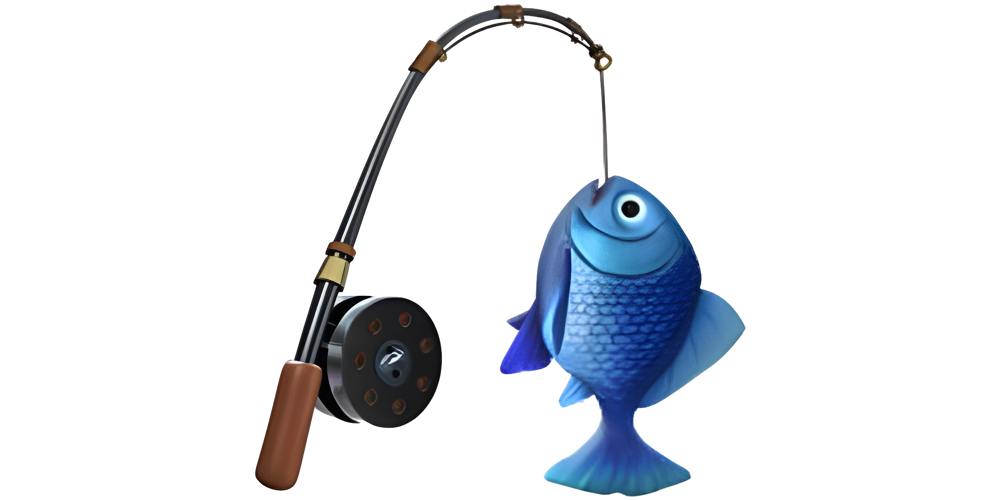

# tuna




## Requirements

- [Apple silicon >= M1](https://support.apple.com/en-us/116943)
- [Python >= 3.11](https://www.python.org/downloads/release/python-3110/)
- [Poetry](https://python-poetry.org/)

## Installation

```bash
poetry install
```

## Examples

#### QLoRA Tuning
Download the example dataset:
```bash
git clone https://github.com/ml-explore/mlx-examples.git
DATASET=$(pwd)/mlx-examples/lora/data
```
Quantize the model:
```bash
poetry run python -m tuna.lora.quantize model=microsoft/phi-2 bits=4
# MODEL=abs/path/to/phi-2_q4
```
Tune the quantized model:
```bash
poetry run python -m tuna.tune model=$MODEL dataset=$DATASET
```

#### LLaVA Tuning
WIP 🚧
